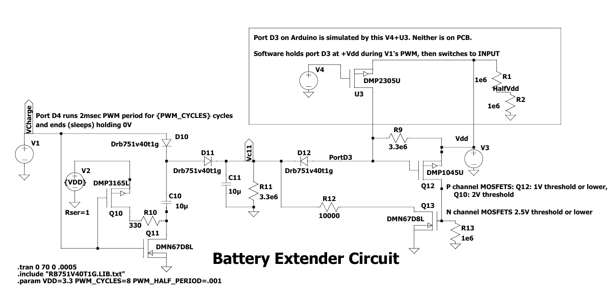

This repository documents a wireless thermometer project. 
Included are: a circuit design using Arduiono, a PCB design for the Arduino Pro Mini, an Arduino sketch. And an outdoor 3D printed enclosure.

The hardware configuration is the combination of the RFM69 wireless module
(<a href='https://learn.sparkfun.com/tutorials/rfm69hcw-hookup-guide'>https://learn.sparkfun.com/tutorials/rfm69hcw-hookup-guide</a>)
and any of several temperature and humidity sensors listed here.
The sensor positions on the PCB are:
<ul>

<li>TMP102. Its SMD board layout puts it at i2c address 0x49.
<li>There are headers  on the PCB for various break out temperature sensors.
The pin hookups are the same for any sensor: GND, VCC (3.3V), SDA, SCL are required.
The pin positions on the various Sparkfun breakout boards differ, which
is why there are several hole patterns on the PCB for headers</li><a href='https://learn.sparkfun.com/tutorials/tmp102-digital-temperature-sensor-hookup-guide'>https://learn.sparkfun.com/tutorials/tmp102-digital-temperature-sensor-hookup-guide.</a>
<li>HIH6131, measures humidity as well as temperature. The PCB layout puts it at i2c 0x27.
<a href='https://www.sparkfun.com/products/11295'>HIH6130</a>
has humidity in addition to temperature, but is limited to -20C to 85C.</li>
<li>Si7021, measures humidity and temperature. It is fixed at i2c 
address 0x40. It has a rather coarse temperature readout--about 1 degree Farenheit resolution
when set to its default 14 bit temperature digitization.
<li>SHT40. measures humdity and temperature. Address 0x44.
<li>TMP175. Temperature only. PCB leaves all address pins floating, therefore its i2c address is 0x37.

</ul>

Battery Extender

Three different circuits for implementing the long sleep time have been implemented. The original design, implemented
on PCB05 and earlier, is simply a parallel RC on the INT pin (D3 on the Arduino). Those components can be
chosen for an RC delay of as much as 100 seconds (10M times 10uF). That slow moving input stays close to
Vcc/2 for an extended period, which in turn causes the Atmega328 to draw up to about 
500uA above its minimal
sleep current for an extended length of time (See the Atmega328P specifications.) PCB06 places an inverting 74HC1G14 schmitt trigger 
to handle the slow-moving RC input. It has a lower current draw near Vcc/2, peaking below 300 uA.
PCB8 implements the MOSFET Battery Extender. PCB9 has PCB placements for all the above. The sketch
must be compiled for the hardware on the PCB, of course. And there is an option in the ino file for "none of the above"
which uses the CPU's Timer2 circuit and constant current draw of about 200uA.

The logic family of the schmitt trigger is important. The
74AHC1G14 draws about triple the current of the 74HC1G14 per their datasheets regarding slow moving inputs through Vcc/2. 
See the file <code>power&nbsp;supply&nbsp;current&nbsp;during&nbsp;RC&nbsp;decay.pdf</code> for actual measurements on a PCB version 6 with the CPU and TMP175 but
no RFM69.

REV08 and later have the Battery Extender Circuit. 
The Battery Extender eliminates the long period of excess current draw by 
accelerating the decay through Vcc/2. The circuit depends on a 
p-channel MOSFET with a low
gate threshold. The nominal threshold of the specified DMP1045U part
is -700mV, well outside of -Vcc/2. That MOSFET, Q12, turns on when the RC circuit at C11, R11 discharges that far
below Vcc. This in turn activates Q13 to quickly truncate the R11/C11 decay through R12, which then
crosses Vcc/2 in a few milliseconds. The other pair of MOSFETs, Q10 and Q11, implements a charge pump so that the
RC circuit discharges from as much as double Vcc (about 6V) to get a much longer time 
delay than is feasible without it.
The capacitors in the Battery Extender circuit can be identical, but must be ceramic 
(for very low leakage current compared to polarized capacitors.) Here is the modeled 
voltage at pin D3 from the LTSpice model.

Later PCB versions can be reverted to the REV05 single R and C timer by omitting all the Battery Extender components
except for  R11 and C11, along with installing a jumper in the holes provided at D12. The
appropriate #define in the ino file for REV05 must be uploaded.

PCB assembly

The parts list for building the PCB, including the Battery Extender: 
<a href='https://www.mouser.com/Tools/Project/Share?AccessID=548d5f9ecc'>
https://www.mouser.com/Tools/Project/Share?AccessID=548d5f9ecc</a>. The headers and battery holders,
and any hardware needed to mount in an enclosure are also needed.

|Quan|Item|Value|Form|
|:-|:-|:-|:-|
4|C1, C2, C3, C5|0.1µF|EIA 1206|
|3|C10, C11, C21|10µF|EIA 0805|
|1|C4|10µF|EIA 1206|
|3|D10, D11, D12|DRB751V40T1G||
|2|HIH6131, TMP175|SO8||
|1|J15|2.1 mm barrel jack PJ-202A|for power plug|
|1|Q10|DMP3165l|SOT23-3|
|2|Q11, Q13|DMN67D8L|SOT23-3|
|1|Q12|DMP1045U|SOT23-3|
|2|R9, R11|3.3M|EIA 0805|
|1|R10|330|EIA 0805|
|1|R12|10K|EIA 0805|
|1|R13|1M|EIA 0805|
|2|R14, R15|2.2K|EIA 0805|
|1|R17|2.7K|EIA 1206|
|1|R21|10M|EIA 0805|

Only one of the battery saver circuit, or the 74HC1G14 time delay circuit, can be installed. 
The battery saver is R9-R13, D10-D12, Q10-Q12, C10 and C11. 
The 74HC1G14 needs R21 and C21.  

While the PCB has multiple positions for placing temperature sensors, the sketch reports temperature
from just one of them per the #define in the ino file.
I had success baking the SMD circuits with tight clearances using the technique in this
<a href='https://www.youtube.com/watch?v=xPFujTJbUkI'>video</a>.
The Battery Extender circuit is positioned under the Pro Mini, which makes it impossible to test
if the Arduino is in place. If you are going to install the assembled PCB in the 3D printed
weather tight enclosure, the assembly only fits if you solder the Pro Mini in place with, at most,
0.100 inch headers between the Arduino and the PCB. That is, you must test the Battery Extender
before soldering the Pro Mini in place. This order of assembly is <i>required</i> for that case
of installing this PCB in the 3D printed enclosure:
<ol>
<li>Prepare an Arduino with headers that can be jumped to headers on the PCB at the Arduino
position. A 5V Arduino (like an Uno or Mega) can be used in this test step, but then you <b><i>must</i></b> omit
all the 3.3 volt parts in the following SMD baking step!
<li>Bake all the Battery Extender SMD components onto the PCB. 
<li>Install headers on the PCB that will eventually be used to mount the 3.3V Pro Mini.
<li>Upload the WirelessThermometer.ino sketch with appropriate #define's set onto the
test Arduino.
<li>Jumper the following pins between the two boards:
<ol>
<li>Ground
<li>RAW (3.3V or 5.0V)
<li>D3
<li>D4
</ol>
<li>At this point the thermometer should successfully sleep according to the parameter SetD4PwmCount.
Set to zero, it should sleep for about 7 or 8 seconds.
SetD4PwmCount up to 255 should sleep for more than 65 seconds.
<li>If you baked a temperature sensor, it should also be printed out on the Serial port.
<li>Once the Battery Extender circuit works as predicted, the remaing top side PCB components should be
mounted <i>except</i> the Pro Mini
<li>Solder the AA cell holder(s) to the PCB bottom. In REV08 of the PCB and later, and using
the Keystone 2462 double AA holder, these last two items can be in either order.
Otherwise, you had better solder the Pro Mini last.
<li>Finally, the Pro Mini may be soldered onto the headers installed in step (3) above.
</ol>

Power options
<ul>
<li>The circuit is simple and can be haywired without a PCB. 
<li>The PCB has positions for two AA cells. It has hole configurations for
cell holders. Either a two-cell keystone 2462 holder or two one-cell keystone 2460 
holders fit. In PCB REV08 and later, the 2462 fits in either of two orientations that are 180 degrees rotated.
<li>On the Arduinio Mini Pro, 3.3V version, remove solder jumper SJ1 to disable
the on-board volatage regulator and, especially, the power drain from its LED. 
<li>Or, a PJ-202A 5.5mm x 2.1mm power jack may be installed on the PCB, which routes up to 12VDC
to the regulator on the Pro Mini. The PCB has holes to accommodate the jack on either
the PCB's top or bottom.
</ul>

SMD components of size 1206 and 0805 are easy enough to solder by hand. 
A pair of AAA lithium cells
powered one of these for 9 months (and counting) with SetDelayLoopCount 
configured such that updates occur about every 11 minutes. A different unit
configured for 5 minute updates lasted 6 months. AA cells are rated
to about twice the Amp-Hour life of the equivalent chemistry AAA cells.

A 2.7K resistor is from A0 to ground for the purpose of telemetering the battery volatage. 

The system is powered with the 2 cell battery wired to VCC (not RAW).

The required SetFrequencyBand settings are documented in RFM69.h (91 in USA). The Arduino
can be programmed through either its serial interface or the ISP pins on the PCB. But
the RFM69 configuration can only be accomplished through the Arduino's serial interface. 

Cover

The CAD directory has a 3D model for a one-piece enclosure that covers the arduino, but leaves the
battery pack exposed. And there is also a 3D model for weather tight O-Ring enclosure that 
mates the PCB holes.

