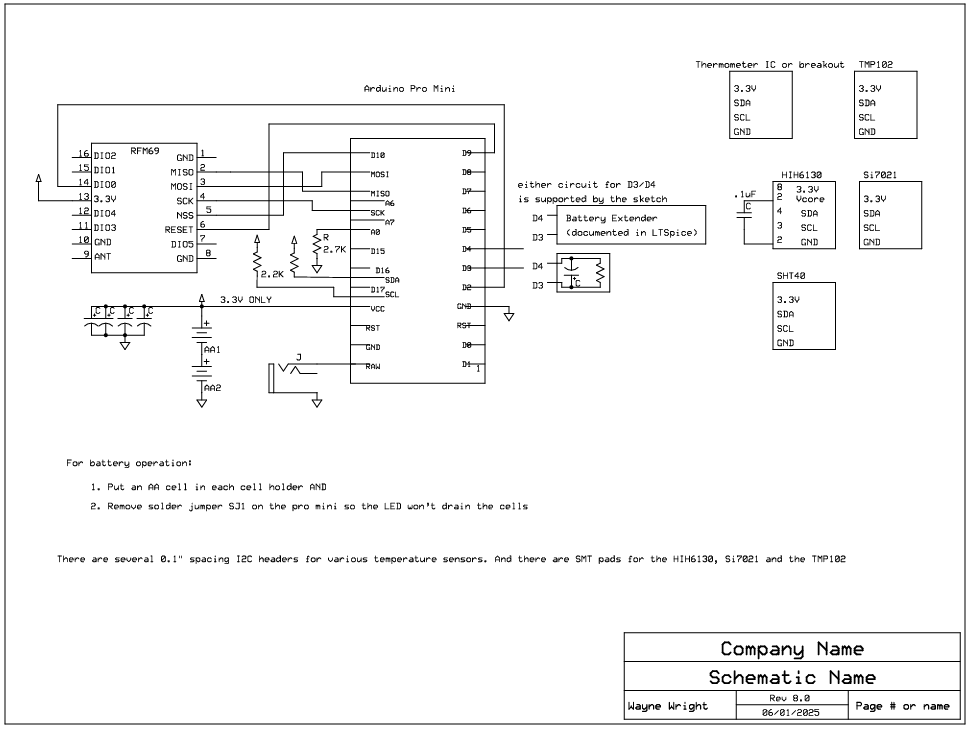

This repository documents a wireless thermometer project. 
Included are: a circuit design using Arduiono, a PCB design for the Arduino Pro Mini, an Arduino sketch. And an outdoor 3D printed enclosure.

The hardware configuration is the combination of the RFM69 wireless module
(<a href='https://learn.sparkfun.com/tutorials/rfm69hcw-hookup-guide'>https://learn.sparkfun.com/tutorials/rfm69hcw-hookup-guide</a>)
and any of several temperature sensors listed here.
The sensor positions on the PCB are:
<ul>

<li>TMP102. Its SMD board layout puts it at i2c address 0x49.
<li>There are headers  on the PCB for various break out temperature sensors.
The pin hookups are the same for any sensor: GND, VCC (3.3V), SDA, SCL are required.
The pin positions on the various Sparkfun breakout boards differ, which
is why there are several hole patterns on the PCB for headers</li><a href='https://learn.sparkfun.com/tutorials/tmp102-digital-temperature-sensor-hookup-guide'>https://learn.sparkfun.com/tutorials/tmp102-digital-temperature-sensor-hookup-guide.</a>
<li>HIH6131, measures humidity as well as temperature. The PCB layout puts it at i2c 0x27.
<a href='https://www.sparkfun.com/products/11295'>HIH6130</a>
has
humidity in addition to temperature, but is limited to -20C to 85C.</li>
<li>Si7021, measures humidity and temperature. It is fixed at i2c 
address 0x40. It has a rather coarse temperature readout--about 1 degree Farenheit resolution
when set to its default 14 bit temperature digitization.
<li>TMP175. Temperature only. PCB leaves all address pins floating, therefore its i2c address is 0x37.

</ul>

Battery Extender

REV07 and later have this Battery Extender Circuit. In the prior versions of the PCB (REV05 and earlier), the sleep time was determined by a 
single R and C on the INT pin (D3 on the Arduino). Those components were
chosen for an RC delay of as much as 100 seconds (10M times 10uF). That slow moving input stays close to
Vdd/2 for an extended period of many dozens of seconds, which in turn causes the Atmega328 to draw up to about 
500uA above its minimal
sleep current for that length of time (See the Atmega328P specifications.)
The Battery Extender eliminates the long period of excess current draw by 
accelerating the pass through Vcc/2. The circuit depends on a 
p-channel MOSFET with a low
gate threshold, Q12. A threshold specification of significantly smaller than -Vdd/2 is required (i.e. much less
than -1.65 volts.) The nominal threshold of the specified DMP1045U part
is -700mV. Q12 turns on when the RC circuit at C11, R11 discharges that far
below Vcc. (Taking into account the diode D12's forward drop&mdash;about 300mV&mdash;means
the trigger is actually at -700mV-300mV, or right at -1 Volt.) When Q12 turns on, 
it causes Q13 to quickly truncate the R11/C11 decay, which then
crosses Vcc/2 in a few milliseconds. The other pair of MOSFETs, Q10 and Q11, implements a charge pump so that the
RC circuit discharges from as much as double Vcc (about 6V) to get a much longer time 
delay than is feasible without it.
The capacitors in the Battery Extender circuit can be identical, but must be ceramic 
(for very low leakage current
compared to polarized capacitors.) An LTSpice model is published here for the Battery Extender.

If the builder desires, you may revert to the REV05 behavior by omitting all the Battery Extender components
except for  R11 and C11.  Install a jumper in the holes provided at D12.
(Why is REV06 not mentioned? It was a failed attempt to extend battery life using an external gate to detect the
decaying RC voltage crossing toward zero. The gate worked no better than the Atmega328 input.)

A second simplifying alternative at build time is to omit the charge pump components: R10, C10, Q10, D10, D11 and Q11.
The result will be the time delay of R11/C11 discharging from one diode drop below Vdd (D12) down to Q12's
gate threshold below Vdd. LTSpice predicts that time to be about 9 seconds, but the actual interval depends strongly
on exactly what the diode drop and the gate threshold happen to be for the components as installed. The charge pump 
makes the delay far longer (43 seconds if charged C10 is dumped only once) and more predictable.

PCB assembly

The parts list for building the PCB, including the Battery Extender: 
<a href='https://www.mouser.com/Tools/Project/Share?AccessID=548d5f9ecc'>
https://www.mouser.com/Tools/Project/Share?AccessID=548d5f9ecc</a>. The headers and battery holders,
and any hardware needed to mount in an enclosure are also needed.

While the PCB has multiple positions for placing sensors, the sketch only reports one of them.
The board position for the TMP102 accommodates that chip's 0.5mm lead spacing. That small spacing
is challenging to hand assemble. I succeeded on three boards, but in the first two attempts, I had
to hand rework after the SMD oven bake resulted in one or more leads not connected. 
The third attempt used the technique in this
<a href='https://www.youtube.com/watch?v=xPFujTJbUkI'>video</a> and resulted in all 6 leads nicely soldered.
The Battery Extender circuit is positioned under the Pro Mini, which makes it impossible to test
if the Arduino is in place. If you are going to install the assembled PCB in the 3D printed
weather tight enclosure, the assembly only fits if you solder the Pro Mini in place with, at most,
0.100 inch headers between the Arduino and the PCB. That is, you must test the Battery Extender
before soldering the Pro Mini in place. This order of assembly is <i>required</i> for that case
of installing this PCB in the 3D printed enclosure:
<ol>
<li>Prepare an Arduino with headers that can be jumped to headers on the PCB at the Arduino
position. If you are going to use a 5V Arduino (like an Uno or Mega) then you MUST omit
all the 3.3 volt parts in the following SMD baking step!.
<li>Bake all the Battery Extender SMD components onto the PCB. (Do not bake  the RFM69 
transceiver. Install it after all the other tests.) If your test Arduino
is 3.3 V, then you may simultaneously bake the sensor. (The Si7021 is 3.3V only!)
<li>Install headers on the PCB that will eventually be used to mount the Pro Mini.
<li>Upload the WirelessThermometer.ino sketch with appropriate #define's set onto the
test Arduino.
<li>Jumper the following pins between the two boards:
<ol>
<li>Ground
<li>RAW (3.3V or 5.0V)
<li>D3
<li>D4
</ol>
<li>At this point the thermometer should successfully sleep according to the parameter SetD4PwmCount.
Set to zero, it should sleep for about 7 or 8 seconds.
SetD4PwmCount up to 255 should sleep for more than 65 seconds.
<li>If you baked a temperature sensor, it should also be printed out on the Serial port.
<li>Once the Battery Extender circuit works as predicted, the remaing top side PCB components should be
mounted <i>except</i> the Pro Mini
<li>Solder the AA cell holder(s) to the PCB bottom
<li>Finally, the Pro Mini may be soldered onto the headers installed in step (3) above.
</ol>

Power options
<ul>
<li>The circuit is simple and can be haywired without a PCB. Its the builder's choice.
<li>The PCB has positions for two AA cells. And the PCB has two hole configurations for
cell holders. Either one two-cell keystone 2462 holder, or two one-cell keystone 2460 holders. 
On the Arduinio Mini Pro, 3.3V version, solder jumper SJ1 is removed to disable
the on-board volatage regulator and, especially, the power drain from its LED.
<li>Or, a PJ-202A 5.5mm x 2.1mm power jack may be installed on the PCB, which routes up to 12VDC
to the regulator on the Pro Mini. The PCB has holes to accommodate the jack on either
the PCB's top or bottom.
</ul>

Of the sleep options available at compile time in this sketch, the best
battery life is obtained an RC circuit.
REV07 and later have the Battery Extender circuit described above.
SMD components of size 1206 and 0805 are easy enough to solder on. 
A pair of AAA lithium cells
powered one of these for 9 months (and counting) with SetDelayLoopCount 
configured such that updates occur about every 11 minutes. A different unit
configured for 5 minute updates lasted 6 months. AA cells are rated
to about twice the Amp-Hour life of the equivalent chemistry AAA cells.

A 2.7K resistor is from A0 to ground for the purpose of 
telemetering the battery volatage. 

The system is powered with a 2 cell AA (or AAA) lithium battery wired to VCC (not RAW).

The required SetFrequencyBand settings are documented in RFM69.h (91 in USA). The Arduino
can be programmed through either its serial interface or the ISP pins on the PCB. But
the RFM69 configuration can only be accomplished through the Arduino's serial interface. 

Cover

The CAD directory has a 3D model for a one-piece enclosure that covers the arduino, but leaves the
battery pack exposed. And there is also a 3D model for weather tight O-Ring enclosure that 
mates the PCB holes.

